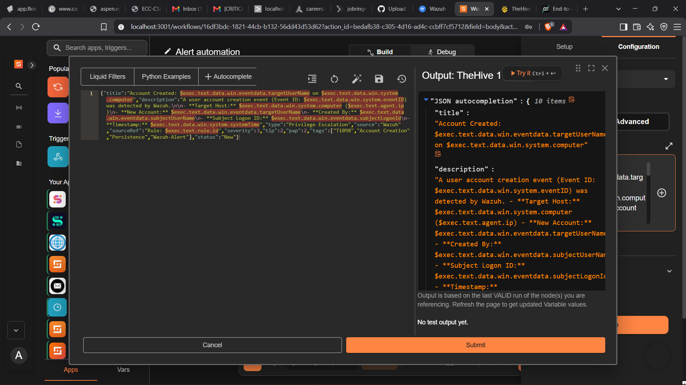

# TheHive App Configuration in Shuffle

The TheHive node is used to automatically create an alert from the Wazuh security event received by the Shuffle webhook.

The configuration is implemented using Shuffle's **Advanced configuration / JSON input** and uses Liquid expressions to extract values from the Wazuh alert.

---

## TheHive Action

The configured Shuffle application is:

```text
Application: TheHive
Action: post_create_alert


