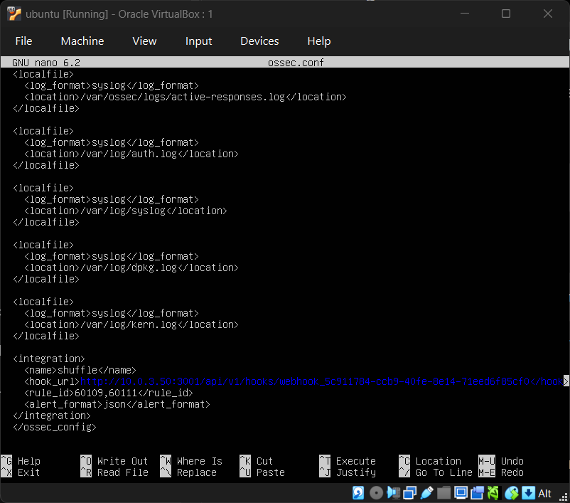

# Wazuh Manager Configuration For webhook

This document describes the relevant `ossec.conf` configuration used by the Wazuh Manager in this SOAR laboratory for webhook. 

The configuration performs two primary functions:

1. Collects local Linux system logs.
2. Sends selected Wazuh alerts to the Shuffle SOAR webhook in JSON format.

The configured architecture is:

```text
Linux System Logs
       │
       ▼
Wazuh Manager
       │
       ├── Log Collection
       │
       ├── Rule Processing
       │
       └── Alert Generation
              │
              │ JSON
              ▼
        Shuffle Webhook
```
## Configuration File

The configuration is maintained in the Wazuh Manager configuration file:

```
/var/ossec/etc/ossec.conf
```

## Shuffle Integration

The most important part of this configuration for the SOAR pipeline is the <integration> section:
```xml
<integration>
  <name>shuffle</name>
  <hook_url>http://10.0.3.50:3001/api/v1/hooks/webhook_5c911784-c0b9-40fe-8e14-71eed6f85cf0</hook_url>
  <rule_id>60109,60111</rule_id>
  <alert_format>json</alert_format>
</integration>
```



### Component Breakdown

| Parameter | Value / Target | Description |
| :--- | :--- | :--- |
| **`<name>`** | `shuffle` | Specifies the integration binary/script (`custom-shuffle`) executed by Wazuh to dispatch alerts to Shuffle SOAR. |
| **`<hook_url>`** | `http://10.0.3.50:3001/...` | The unique webhook URI exposed by Shuffle that triggers the automation workflow upon receiving incoming data. |
| **`<rule_id>`** | `60109, 60111` | Limits execution strictly to alerts matching rules **60109** and **60111**, preventing workflow clutter and API exhaustion. |
| **`<alert_format>`** | `json` | Formats the alert output as structured JSON so Shuffle can parse individual alert fields (IPs, usernames, hashes, event IDs) natively. |

---

### Workflow Overview

1. **Detection:** Wazuh Manager detects an event triggering Rule ID **60109** or **60111**.
2. **Payload Delivery:** Wazuh packages the full event log into JSON format and sends an HTTP POST request to the designated Shuffle Webhook URL.
3. **SOAR Execution:** Shuffle receives the payload, parses the event details, and kicks off automated workflows (e.g., alert triage, enrichment, creating cases in TheHive, or sending SOC notifications)


