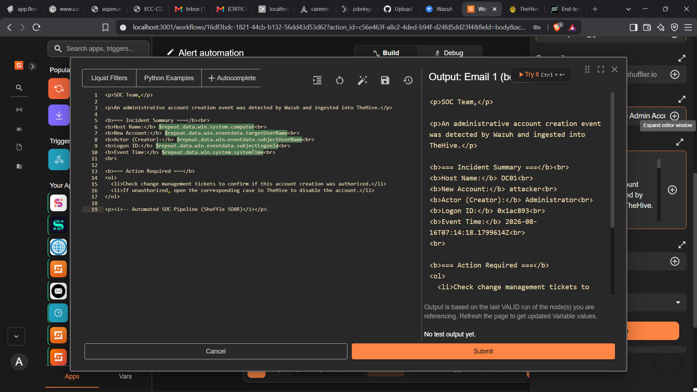

# Email Alerting Configuration in Shuffle

The **Email** node in the Shuffle SOAR workflow is responsible for sending an automated security notification to the SOC analyst after a Wazuh alert has been processed.

The node uses the **Send email smtp** action.

```text
Wazuh Alert
     │
     ▼
Shuffle Webhook
     │
     ▼
Repeat / Alert Processing
     │
     ├───────────────┐
     │               │
     ▼               ▼
 TheHive           Email
                       │
                       ▼
                 SOC Analyst
```
## SMTP Configuration
| Parameter  | Configuration                              |
| ---------- | ------------------------------------------ |
| SMTP Host  | `smtp.gmail.com`                           |
| SMTP Port  | `587`                                      |
| Username   | `socanalyst59@gmail.com`                   |
| Password   | Configured in Shuffle and masked in the UI |
| SSL Verify | `True`                                     |
| Action     | `send_email_smtp`                          |


## Recipient and Sender
since this is home lab set I've used same email address for both sender and recipient.
 socanalyst59@gmail.com

## Email Subject and Body
The subject is configured as [CRITICAL ALERT] Rogue Admin Account Created on $repeat.agent.name

And the body is set as:


```
<p>SOC Team,</p>

<p>An administrative account creation event was detected by Wazuh and ingested into TheHive.</p>

<b>=== Incident Summary ===</b><br>
<b>Host Name:</b> $repeat.data.win.system.computer<br>
<b>New Account:</b> $repeat.data.win.eventdata.targetUserName<br>
<b>Actor (Creator):</b> $repeat.data.win.eventdata.subjectUserName<br>
<b>Logon ID:</b> $repeat.data.win.eventdata.subjectLogonId<br>
<b>Event Time:</b> $repeat.data.win.system.systemTime<br>
<br>

<b>=== Action Required ===</b>
<ol>
  <li>Check change management tickets to confirm if this account creation was authorized.</li>
  <li>If unauthorized, open the corresponding case in TheHive to disable the account.</li>
</ol>

<p><i>-- Automated SOC Pipeline (Shuffle SOAR)</i></p>

```


