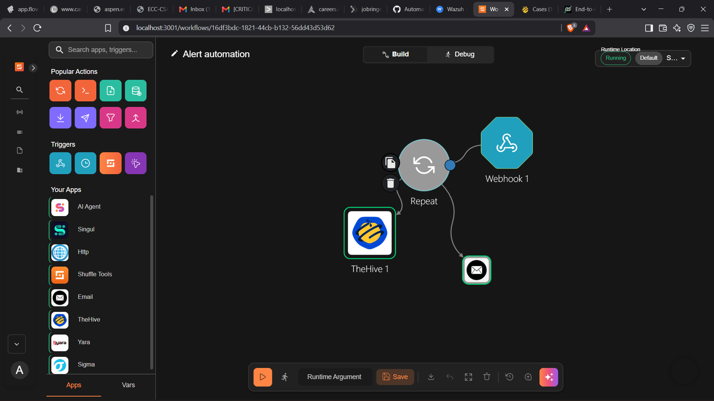
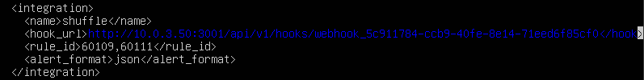
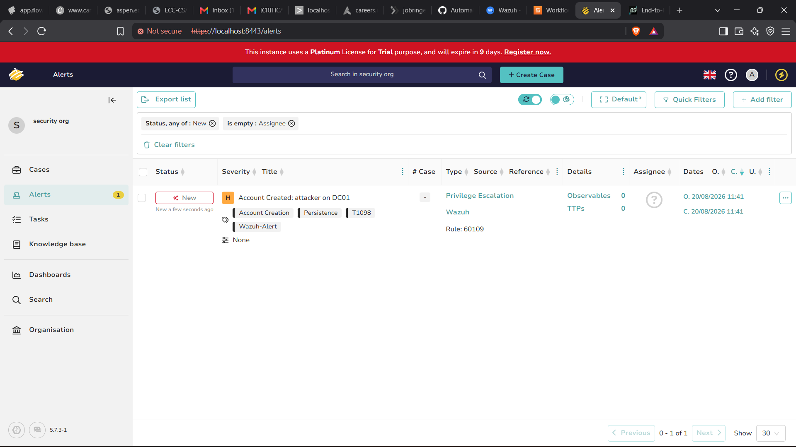
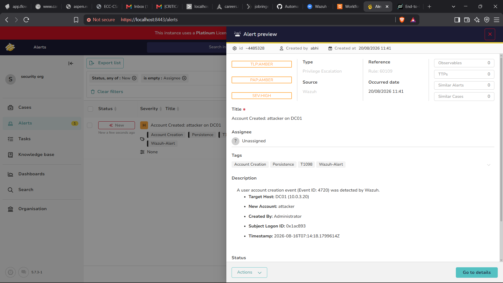
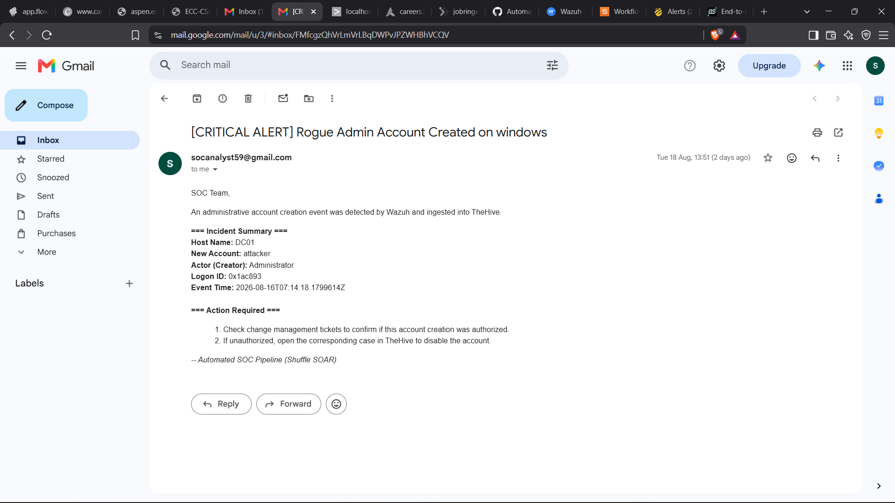

## Shuffle Automation Workflow: `Alert automation`



## Overview
This workflow implements an automated SOC alert-processing pipeline using Wazuh, Shuffle SOAR, TheHive, and Email.

The purpose of the workflow is to eliminate manual alert forwarding and provide a complete automated path from security event detection to incident creation and analyst notification.

The workflow follows this sequence:
```
┌──────────────┐
│    Wazuh     │
│ SIEM / XDR   │
└──────┬───────┘
       │ Alert generated
       ▼
┌──────────────┐
│   Webhook    │
│ Shuffle SOAR │
└──────┬───────┘
       │
       ▼
┌──────────────┐
│    Repeat    │
│ / Processing │
└──────┬───────┘
       │
       ├──────────────────┐
       ▼                  ▼
┌──────────────┐   ┌──────────────┐
│   TheHive    │   │    Email     │
│ Create Alert │   │ Notification │
└──────────────┘   └──────────────┘
```

The result is that a Wazuh alert is automatically converted into a structured alert in TheHive while simultaneously sending an email notification to the SOC analyst.

## Components Used

| Component | Purpose |
| :--- | :--- |
| **Wazuh** | Detects and generates security alerts |
| **Shuffle SOAR** | Receives, processes, and automates the alert workflow |
| **Webhook** | Entry point for Wazuh alerts into Shuffle |
| **Repeat** | Handles the workflow execution and forwards the alert to downstream actions |
| **TheHive** | Stores and manages the security alert as an incident |
| **Email** | Sends an immediate notification to the SOC analyst |

## End-to-End Workflow
The complete automation can be divided into the following stages:

* Security event occurs on the monitored endpoint.
* Wazuh agent collects the relevant event.
* Wazuh Manager analyzes the event.
* A Wazuh rule generates a security alert.
* Wazuh sends the alert to the Shuffle webhook.
* Shuffle receives the alert through the Webhook trigger.
* Shuffle processes the received alert.
* The workflow forwards the relevant alert information to TheHive.
* TheHive creates a new security alert.
* The same workflow sends an email notification.
* The SOC analyst can investigate the alert in TheHive and through the email notification.

# Stage 1 – Security Event Detection in Wazuh

The process begins when a security-relevant event occurs on a monitored endpoint.

For example, in this implementation, a Windows account creation event was detected.

The Windows event was associated with:

Event ID: 4720

Event ID 4720 indicates that a user account was created.

Wazuh receives the Windows security event through the Wazuh agent and evaluates it against its configured detection rules.

In this example, the Wazuh rule generated:

Rule ID: 60109

The resulting alert contained information such as:

Alert:
Account Created: attacker on DC01

Target Host:
DC01

IP Address:
10.0.3.20

New Account:
attacker

Created By:
Administrator

Event ID:
4720

The alert was categorized with security context including:

Account Creation
Persistence
T1098

This allows the event to be treated as a potentially malicious account creation or persistence activity.

# Stage 2 – Wazuh Sends the Alert to Shuffle

After Wazuh generates the alert, the alert is forwarded to the Shuffle SOAR platform using a webhook integration.

The Wazuh integration configuration contains a Shuffle webhook endpoint.

Conceptually, the configuration follows this structure:



The actual webhook URL is configured according to the local Shuffle deployment.

The important function of this integration is:

Wazuh Alert
     │
     ▼
Shuffle Webhook

Instead of requiring a SOC analyst to manually copy the Wazuh alert into another platform, the alert is automatically transmitted to Shuffle.

This is the first major automation point in the pipeline.

# Stage 3 – Shuffle Webhook Trigger

The Shuffle workflow begins with a Webhook trigger.

The webhook acts as the external entry point for the automation.

The workflow shown in Shuffle contains:

```
Webhook 1
     │
     ▼
Repeat
```

The webhook receives the HTTP request generated by Wazuh and makes the alert data available to the rest of the workflow.

The received payload contains the Wazuh alert information, including fields such as:

* Alert title
* Rule ID
* Host information
* Event information
* Timestamp
* User/account information
* MITRE ATT&CK information
* Severity and other alert metadata

This allows Shuffle to use the original Wazuh alert as the input for subsequent automated actions.

# Stage 4 – Shuffle Workflow Processing

After receiving the alert, Shuffle passes the data into the next workflow stage.

The workflow uses a Repeat node as part of the processing and execution flow.

The workflow architecture is:
```

                    ┌──────────────┐
                    │   Webhook    │
                    │  Wazuh Input │
                    └──────┬───────┘
                           │
                           ▼
                    ┌──────────────┐
                    │    Repeat    │
                    └──────┬───────┘
                           │
                 ┌─────────┴─────────┐
                 │                   │
                 ▼                   ▼
          ┌─────────────┐     ┌─────────────┐
          │   TheHive   │     │    Email    │
          │    Alert    │     │ Notification│
          └─────────────┘     └─────────────┘
```

The workflow therefore performs multiple downstream actions from the received security alert.

This is the core SOAR functionality of the project: one security event triggers multiple automated response actions.

# Stage 5 – Creating the Alert in TheHive

One of the main actions performed by Shuffle is forwarding the alert to TheHive.

The purpose of this integration is to convert the raw Wazuh detection into a manageable security alert inside the incident-response platform.

TheHive receives information from the Wazuh alert and creates a new alert.



In the demonstrated alert, TheHive displays:

| Attribute | Value |
| :--- | :--- |
| **Title** | `Account Created: attacker on DC01` |
| **Severity** | 🔴 `SEV: HIGH` |
| **Type** | Privilege Escalation |
| **Source** | Wazuh |
| **Reference** | Rule `60109` |
| **Tags** | `Account Creation` `Persistence` `T1098` `Wazuh-Alert` |

This information makes the alert much more useful for SOC investigation than simply receiving a raw log entry.

### TheHive Alert Details



The generated TheHive alert contains the relevant information extracted from the Wazuh event.

 
> **Description:**  
> A user account creation event (`Event ID: 4720`) was detected by Wazuh.
> 
> ---
> 
> * **Target Host:** `DC01 (10.0.3.20)`
> * **New Account:** `attacker`
> * **Created By:** `Administrator`
> * **Subject Logon ID:** `0x1ac893`
> * **Timestamp:** `2026-08-16T07:14:18.1799614Z`

This gives the SOC analyst enough context to begin investigating the event.

TheHive therefore acts as the central incident-management layer of the workflow.

### TheHive Alert Classification

The automation also adds contextual information to the alert.

The example alert is classified as:

* Type: Privilege Escalation
* Severity: High
* Source: Wazuh
* Reference: Rule 60109

The alert contains the following tags:

* Account Creation
* Persistence
* T1098
* Wazuh-Alert

The MITRE ATT&CK technique:

* T1098 – Account Manipulation

provides additional threat-context for the event.

This allows analysts to quickly understand the potential attack behavior associated with the alert.

# Stage 6 – Email Notification

In parallel with the TheHive integration, Shuffle sends an email notification.

This provides an immediate notification mechanism for the SOC analyst.



# Final Workflow Result

Once the workflow completes, the same Wazuh security event is available through two response channels:
```
                     Wazuh
                       │
                       ▼
                  Shuffle Webhook
                       │
                       ▼
                  Shuffle SOAR
                       │
              ┌────────┴────────┐
              │                 │
              ▼                 ▼
           TheHive            Email
              │                 │
              ▼                 ▼
       Investigation        Analyst
       & Case Handling     Notification
```
#### TheHive

TheHive provides:

 * Centralized alert management
 * Severity classification
 * MITRE ATT&CK context
 * Alert tags
 * Host information
 * Event details
 * Investigation and case-management capabilities

### Email

The email provides:

 * Immediate notification
 * Incident summary
 * Affected host
 * Created account
 * Event timestamp
 * Recommended analyst action


